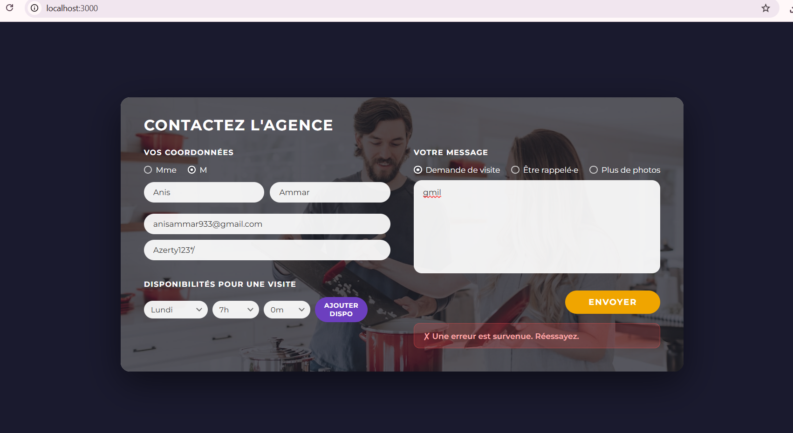

Anis AMMAR 
Ingénieur Inofrmatique + Master en web (en cours)
2 mois ou +++ 

## Stack
- **Frontend** : React 18
- **Backend** : Node.js + Express
- **Base de données** : MongoDB (Mongoose)

## Lancer le projet

### 1. Backend
```bash
cd backend
npm install
node server.js
```

### 2. Frontend
```bash
cd frontend
npm install
npm start
```

### 3. Questions 
1. L’exercice était globalement intéressant mais plutôt intermédiaire en difficulté
2. Oui, je suis déjà à l’aise avec ce type d’outils. J’ai l’habitude de travailler sur des projets  similaires, voire plus complexes, ce qui m’a permis d’aborder cet exercice sans difficulté particulière
3. Le développement web occupe une place importante dans mon cursus
4. Oui, j’ai utilisé un LLM comme support je fais attention à ne pas copier directement les réponses

